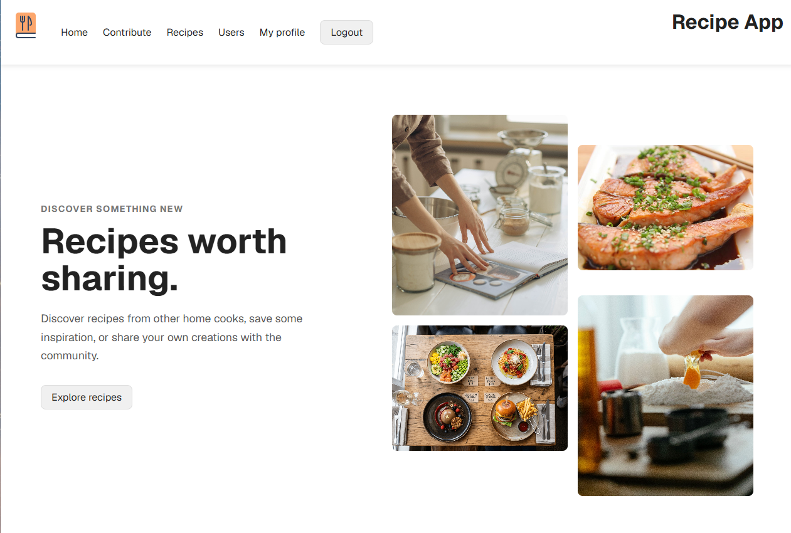

# Ruokareseptit

- Sovelluksessa käyttäjät pystyvät jakamaan ruokareseptejään. Reseptissä lukee tarvittavat ainekset ja valmistusohje.
- Käyttäjä pystyy luomaan tunnuksen ja kirjautumaan sisään sovellukseen.
- Käyttäjä pystyy lisäämään reseptejä ja muokkaamaan ja poistamaan niitä.
- Käyttäjä näkee sovellukseen lisätyt reseptit.
- Käyttäjä pystyy etsimään reseptejä hakusanalla.
- Käyttäjä pystyy etsimään käyttäjiä hakusanalla.
- Käyttäjäsivu näyttää, montako reseptiä käyttäjä on lisännyt ja listan käyttäjän lisäämistä resepteistä.
- Käyttäjä pystyy valitsemaan esimerkiksi seuraavia luokitteluja:
- Ruoan tyyppi, ruokavalio, valmistusaika, reseptistä saatava annosten määrä, kuvat ja muut lisätiedot.
- Käyttäjä pystyy antamaan reseptille kommentin ja arvosanan. Reseptistä näytetään kommentit ja keskimääräinen arvosana ja kaikki arvosanat.

Tässä pääasiallinen tietokohde on ruokaresepti ja toissijainen tietokohde on kommentti reseptiin.

# Projektin rakenne

## Kansiot

- `db/` – Tietokantaan liittyvät toiminnot: migraatiot, datan alustus ja funktiot.
- `routes/` – Reititykset eri resursseille.
- `services/` – Resurssien toiminnalliset funktiot.
- `static/` – Staattiset tiedostot: kuvat, CSS ja fontit.
- `templates/` – HTML-templaatit.
- `utils/` – Muut yleiset apufunktiot ja resurssit, kuten dekoraattorit ja muuttumattomat muuttujat.

## Tiedostot

- `.env` – Säilytyspaikka session secretille ja muille salaisuuksille.
- `app.py` – Sovelluksen entrypoint.
- `database.db` – Generoitu tietokanta.
- `requirements.txt` – Ulkoiset kirjastoriippuvuudet.

# Kehitys

## Sovelluksen käynnistys

Alusta kehitysympäristö:

Luo virtuaali ympäristö

```bash
python3 -m venv .venv
```

Asenna riippuvuudet

```bash
.venv/bin/pip install -r requirements.txt
```

Luo .env tiedosto ja lisää sinne:

```bash
SECRET_KEY=74ae93c8179cea32ded4403efa7c9ba1729ed26e23b9c5e3027119f3b9a63faf
```

Käynnistä sovellus kehitystilassa (.env tiedoston kanssa):

```bash
set -a; . ./.env; set +a; .venv/bin/flask run --debug
```

## Ongelmatilanteet

Ongelmatilanteissa ota yhteyttä:

`oskari.anton.sulkakoski@helsinki.fi`

# Suorituskyky

- 10^6 käyttäjää
- 10^6 reseptiä

käyttäjä ja resepti haku noin 1.5s

käyttäjät ja reseptit sivut latautuu noin 1s
käyttäjä ja resepti sivu latautuu noin 1s
